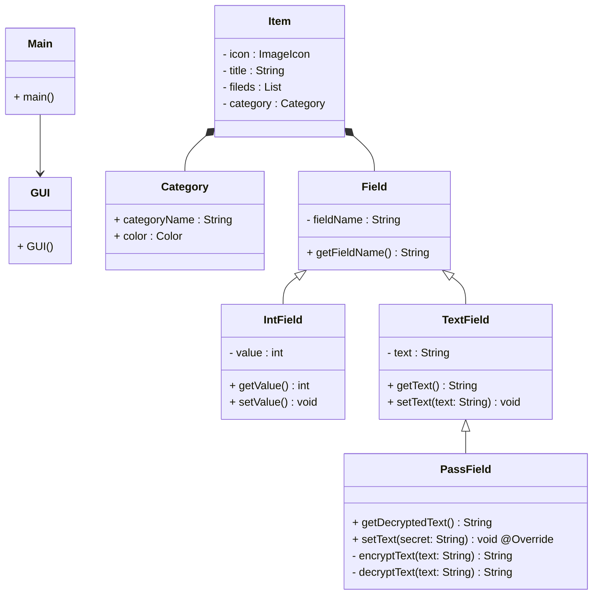

# Vault-Vader
This is a Password Manager application which is written in Java with Swing.

# UML - diagram

```mermaid
classDiagram
    class Main{
        + main()
    }
    class GUI{
        + GUI()
    }
    class Item{
        - icon : ImageIcon
        - title : String
        - fileds : List<Field>
        - category : Category
    }
    class Category{
        + categoryName : String
        + color : Color
    }
    class Field{
        - fieldName : String
        + getFieldName() String
    }
    class IntField{
        - value : int
        + getValue() int
        + setValue() void
    }
    class TextField{
        - text : String
        + getText() String
        + setText(text: String) void
    }
    class PassField{
        + getDecryptedText() String
        + setText(secret: String) void @Override
        - encryptText(text: String) String
        - decryptText(text: String) String
    }
    
    Main --> GUI 
    
    Item *-- Field
    Item *-- Category
   
    Field <|-- TextField
    Field <|-- IntField
    TextField <|-- PassField

```