# Vault-Vader
> Created by Marton Szenes, alias Spyro  
> Last update: 2024.09.18.

This is a Password Manager application which is written in Java with Swing.

# Images

>   
> *Login screen*

>   
> *Main screen*

# Diagrams

## Overvirew


## Frontend UML diagram


## Backend UML diagram 


## Detailed UML diagram

```mermaid
classDiagram
    direction TB
    namespace frontend {
        
        class LoginUI{
            + main()
            + LoginUI()
            - initMinimalistLoginUI() void
            - userFiledsToJSON() JSON 
        }
        class MainUI{
            + MainUI()
            - refresh() void
            - createItemJList(itemList: List~Item~) List~JList~
            - displayItem(index: int) void
        }
       
        class CategoryTreeRenderer {
            + CategoryTreeRenderer()
            + getTreeCellRendererComponent(...) Component
        }
        class ItemCellRenderer {
            - titleLabel : JLabel
            - categoryLabel : JLabel
            - icon : JButton
            + ItemCellRenderer()
            + getListCellRendererComponent(...) Component
        }
        class IconButton {
            + IconButton()
            + IconButton(icon: Icon)
            + IconButton(text: String)
            + IconButton(text: String, icon: Icon)
            +IconButton(text: String, resourcePath: String)
            - setup() void
            # paintComponent(g: Graphics) void
        }
        class DarkComboField {
            - placeholder : String
            + DarkComboField(values: String[])
            + DarkComboField(values: String[], placeholder: String)
            + DarkComboField(values: String[], placeholder: String, underline: bool)
            - setup() void
            + setUnderline(underline: bool) void
        }
        class DarkPassField {
            - placeholder : String
            - defChar: char
            + DarkPassField(text: String)
            + DarkPassField(text: String, placeholder: String)
            + DarkPassField(text: String, placeholder: String, underline: bool)
            - setup() void
            + setUnderline(underline: bool) void
        }
        class DarkTextField {
            - placeholder : String
            + DarkTextField(text: String)
            + DarkTextField(text: String, placeholder: String)
            + DarkTextField(text: String, placeholder: String, underline: bool)
            - setup() void
            + setUnderline(underline: bool) void
        }
        class FieldPanel {
            + optionsButton: IconButton
            + dataField: JComponent
            + FieldPanel(dataField: JComponent)
            - moreOptionsButtonClicked(Actionevent e) void
        }
        class ItemEditorPanel {
            - titleRow: JPanel
            - iconButton: IconButton
            - titleField: DarkTextField
            - addNewFieldButton: IconButton
            - window: MainUI
            - displayedItem: Item
            + fieldList: List~FieldPanel~
            + ItemEditorPanel(window: MainUI)
            + hidePanel() void
            + displayItem(displayedItem: Item) void
            - iconSelectorButtonClicked(e: ActionEvent ) void
            - addNewFieldButtonClicked(e: ActionEvent ) void
            - popupMenuItemClicked(chosenType: FieldType) void
        }

    }
    
    MainUI --> CategoryTreeRenderer
    MainUI --> ItemCellRenderer
    MainUI --> DarkComboField
    MainUI --> DarkPassField
    MainUI --> DarkTextField
    LoginUI --> DarkTextField
    MainUI --> FieldPanel
    MainUI --> ItemEditorPanel
    LoginUI --> IconButton
    MainUI --> IconButton
    
    CategoryTreeRenderer --|> DefaultTreeCellRenderer
    ItemCellRenderer ..|> ListCellRenderer~Item~
    ItemCellRenderer --|> JPanel
    
    IconButton --|> JButton
    DarkComboField --|> JBComboField
    DarkPassField --|> JPassField
    DarkTextField --|> JTextField
    FieldPanel --|> JPanel
    ItemEditorPanel --|> JPanel
    
%%    FieldPanel --> IconButton
    
    
    namespace backend {
            
        class Controller{
             <<singleton>>
             + INSTANCE : Controller$
             - items : List~Item~
             - categories : List~String~
             - loggedInuser : User
             - Controller()
             + encryptText(text: String, key: String) String$
             + loadUser() void
             + checkUser(userData: JSON) boolean
             + createUser(userData: JSON) boolean
             + getCategoryList() List~String~
             + addNewCategory(newCategory: String) bool
             + modifyCategory(oldCategory: String, newCategory: String) bool
             + removeCategory(categoryName: String) bool
             + saveAll() void
             + getItem(index: int) Item
             + getItemList() List~Item~
             - readUserDataFromFile() void
             - writeUserDataToFile() void
%%             - decryptText(text: String, key: String) String
        }
        class User{
            - name : String
            - password : String
            + getName() String
            + getPassword() : String
        }
        class Item{
            - icon : ImageIcon
            - title : String
            - category : String
            - fileds : List~Field~
        }
        class Field{
            - fieldName : String
            + getFieldName() String
        }
      
    }

    Controller o-- User
    Controller o-- Item

    Item *-- Field

    class API{
        + loginRequest(userData: JSON) bool$
        + registerRequest(userData: JSON) bool$
        + logoutRequest() void$
        + addNewItem(itemData: JSON) bool$
        + saveItem(itemDate: JOSN) bool$
        + removeItem(itemData: JSON) bool$
        + addNewCategory(categoryData: JSON) bool$
        + modifyCategory(categoryData: JSON) bool$
        + removeCategory(categoryData: JSON) bool$
        + getItemData(intemIndex: int) Item$
        + getItemList(filter: JSON) List~Item~$ 
        + getCategoryList() List~String~ JSON$
        + encryptData(data: String, key: String) String$
        + saveAllChanges() void$
    }
    
    API --> Controller
    API <-- LoginUI
    API <-- MainUI
%%    LoginUI --> API
%%    MainUI --> API
 
   

```



## Data storage

JSON file name is the username ->  1 file per user

```json
{
  "username": "username",
  "password": "*x&%645&",
  "categories": [
        "Example category 1", 
        "Example category 2",
        "Example category 3"    
  ],
  "items": [
    {
      "title": "Item Title",
      "category": "Category name",
      "fields": [
        {
          "type" : "TextField / IntField / PassField",
          "fieldName": "Field Name",
          "value": "Value of the field"
        }
      ]
    }
  ]
}
```


## API request sequences

### Login Request 


### Register Request


