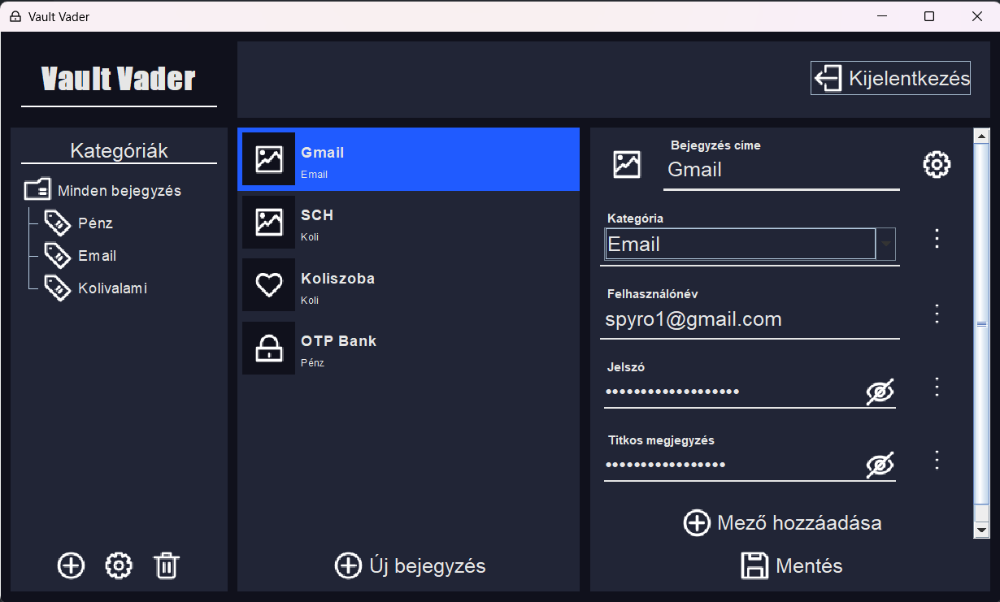

# Vault-Vader - Dokumentáció

> Írta: Szenes Márton Miklós - Dátum: 2024.10.24.

## Tartalom

- [Vault-Vader - Dokumentáció](#vault-vader---dokumentáció)
  - [Tartalom](#tartalom)
  - [Specifikáció](#specifikáció)
- [Felhasználói dokumentáció](#felhasználói-dokumentáció)
  - [Futtatási útmutató](#futtatási-útmutató)
  - [Használat](#használat)
    - [Bejelentkezés](#bejelentkezés)
    - [Főképernyő](#főképernyő)
- [Programozói dokumentáció](#programozói-dokumentáció)
  - [Főbb Funkciók](#főbb-funkciók)
  - [Főbb Osztályok](#főbb-osztályok)
    - [`Controller`](#controller)
    - [`User`](#user)
    - [`Item`](#item)
    - [`FieldType`](#fieldtype)
    - [`Field`](#field)

## Specifikáció

A **Vault-Vader** egy jelszókezelő alkalmazás, amelyet Java nyelven, Swing GUI felülettel valósítunk meg. Az alkalmazás lehetővé teszi a felhasználók számára a saját profiljuk létrehozását, bejegyzések létrehozását és kezelését, amiben jelszavaik és egyéb érzékeny adataikat kezelhetik, illetve kategóriákat hozhatnak létre a bejegyzések csoportosításához.

---

# Felhasználói dokumentáció

## Futtatási útmutató

1. Környezet Beállítása:
   - Győződj meg arról, hogy a következő eszközök telepítve vannak:
     - **JDK 21**
     - **Maven** (opcionális, ha Maven alapú buildet használ)
2. Fordítás és Futtatás:
   - A projekt fordítása Maven segítségével:
      ```bash 
      mvn clean install
      ```
      ```bash
      java -jar .\target\Vault-Vader-1.0-SNAPSHOT.jar
      ```
3. Ha nem működne a 2. pont, akkor az előre buildelt projektet tartalmazó jar file futtatása: 
      ```bash
      java -jar out/artifacts/Vault_Vader_Maven_jar/Vault-Vader-Maven.jar 
      ```

## Használat

### Bejelentkezés

A program futtatása után megjeleneik a bejelentkező képernyő (`LoginUI`), ahol meg kell adni a felhasználó nevét és jelszavát.
- Ha már van felhasználója, akkor a bejelentkezés gombra kattintva a program betölti a felhasználó adatait és új képernyő jelenik meg.
- Ha még nincs regisztrált felhasználója, akkor a mezők kitöltése után a regisztráció gombra kattintva, és a felugró párbeszédablakban az *Igen*-re kattintva elkészíti a program a felhasználót. Majd a megadott adatokkal tud bejelentkezni a bejelentkezés gombra kattintva ezután.


### Főképernyő

A főképernyő megjelenéseker az alábbi panelok láthatóak:

Fejléc
:  Itt található meg a kijelentkezés gomb a kilépéshez, illetvea projekt neve a bal oldalt.

Kategória kezelő
: A panel alján található gombokkal új kategóriákat felvenni, a kijelölt kategóriákat módosítani vagy törölni.

Bejegyzés választó
: A középső panelon láthatóak egy listában felsorolva a felhasználó által létrehozott bejegyzések, amelyeket kijelölve megejeleníti a program a szerkesztőben. A panle alján található *Új bejegyzés* gombbal létrejön a szerkesztő felületen egy üres új bejegyzés.

Bejegyzés szerkesztő 
: A jobb oldali panelon jelennek meg a bejegyzés mezői. A bal felső sarkában a bejegyzéshez tartozó ikont lehet kiválasztani a gombbal, melette ki kell tölteni kötelező mezőket, a bejegyzés címét és a kategóriáját. Ezen felül opcionálisan lehet felvenni új szöveg/jelszó mezőket, átnevezni őket vagy törölni is, ha nincs rá szükég a mezők jobb szélén található opció gombra kattintva. Az egész bejegyzést is lehet törölni vagy csak bezárni ha nem szeretnénk elmenteni a módosításokat a jobb felső fogaskerék ikonra kattintva. A módosításokat a panel alján található mentés gombbal lehet jóvá hagyni.
A jelszó mezők jobb szélén található szem ikonnal pedig megtekinthető/elrejthető a jelszó szöveges tartalma.



---

# Programozói dokumentáció

## Főbb Funkciók

- **Felhasználókezelés**: Bejelentkezés és regisztráció, felhasználói adatmentés fájlba.
- **Adatmentés és visszatöltés**: A felhasználók adatai JSON formátumban kerülnek mentésre a fájlrendszerben.
- **Kategóriakezelés**: Új kategóriák hozzáadása, meglévők módosítása vagy törlése.
- **Titkosítás**: A jelszavak titkosított formában kerülnek tárolásra.
- **Bejegyzések kezelése**: Felhasználók jelszavaikat és egyéb információikat bejegyzések formájában tárolhatják a különböző fiókjaikhoz.

---

## Főbb Osztályok

### `Controller`
- **Felelősség**: Ez az osztály felelős az alkalmazás központi logikájáért, beleértve a felhasználók kezelését, bejegyzések kezelését, adatmentést és betöltést, valamint a titkosítást.
- **Singleton minta**: Ez az osztály singleton mintát használ, hogy biztosítsa, hogy az alkalmazásban csak egy példány létezzen.

### `User`
- **Felelősség**: Felhasználói objektum, amely tartalmazza a felhasználó nevét és jelszavát (titkosított formában).
- **Funkciók**: JSON reprezentációra való átalakítás, valamint visszaállítás JSON-ból.


### `Item`
- **Felelősség**: Ez az osztály reprezentál egy jelszóbejegyzést vagy egyéb bizalmas adatot. Tartalmazza az adatokat, és képes azokat JSON objektummá alakítani.

### `FieldType`
- **Felelősség**: 

### `Field`
- **Felelősség**:

---

