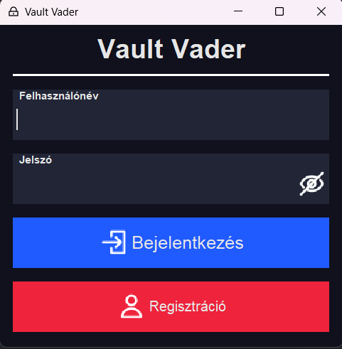

# Vault-Vader - Dokumentáció

> Írta: Szenes Márton Miklós - Dátum: 2024.10.24.

## Tartalom

- [Vault-Vader - Dokumentáció](#vault-vader---dokumentáció)
  - [Tartalom](#tartalom)
  - [Specifikáció](#specifikáció)
- [Felhasználói dokumentáció](#felhasználói-dokumentáció)
  - [Futtatási útmutató](#futtatási-útmutató)
  - [Használat](#használat)
    - [Főbb Funkciók](#főbb-funkciók)
    - [Bejelentkezés](#bejelentkezés)
    - [Főképernyő](#főképernyő)
- [Programozói dokumentáció](#programozói-dokumentáció)
  - [Controller osztály](#controller-osztály)
    - [Fő funkciók](#fő-funkciók)
    - [Adattagok](#adattagok)
    - [Publikus interfészek](#publikus-interfészek)
      - [Felhasználókezelés](#felhasználókezelés)
      - [Titkosítás](#titkosítás)
      - [Kategóriakezelés](#kategóriakezelés)
      - [Bejegyzés kezelés](#bejegyzés-kezelés)
      - [Ideiglenes bejegyzés kezelés](#ideiglenes-bejegyzés-kezelés)
  - [JSONSerializable interfész](#jsonserializable-interfész)
    - [Publikus interfészek](#publikus-interfészek-1)
  - [User osztály](#user-osztály)
    - [Főbb funkciók](#főbb-funkciók-1)
    - [Adattagok](#adattagok-1)
    - [Publikus interfészek](#publikus-interfészek-2)
  - [Item osztály](#item-osztály)
    - [Adattagok](#adattagok-2)
    - [Konstruktorok](#konstruktorok)
    - [Publikus interfészek](#publikus-interfészek-3)
  - [FieldType enum](#fieldtype-enum)
    - [Mezők](#mezők)
    - [Publikus interfészek](#publikus-interfészek-4)
  - [Field osztály](#field-osztály)
    - [Mezők](#mezők-1)
    - [Publikus interfészek](#publikus-interfészek-5)
  - [API osztály](#api-osztály)
    - [Konstans adattagok](#konstans-adattagok)
    - [Objektum referencia](#objektum-referencia)
    - [Publikus interfészek](#publikus-interfészek-6)
  - [LoginUI osztály](#loginui-osztály)
    - [Publikus interfész](#publikus-interfész)
  - [MainUI osztály](#mainui-osztály)
    - [Publikus interfész](#publikus-interfész-1)
    - [Megvalósított funkcionalitások](#megvalósított-funkcionalitások)
- [Diagrammok](#diagrammok)
  - [Program UML diagram áttekintés](#program-uml-diagram-áttekintés)
  - [Frontend UML diagram áttekintés](#frontend-uml-diagram-áttekintés)
  - [Backend UML diagram áttekintés](#backend-uml-diagram-áttekintés)
  - [Részletes UML diagram](#részletes-uml-diagram)
  - [Fájlkezelés](#fájlkezelés)
    - [A fájl felépítése](#a-fájl-felépítése)

## Specifikáció

A **Vault-Vader** egy jelszókezelő alkalmazás, amelyet Java nyelven, Swing GUI felülettel valósítunk meg. Az alkalmazás lehetővé teszi a felhasználók számára a saját profiljuk létrehozását, bejegyzések létrehozását és kezelését, amiben jelszavaik és egyéb érzékeny adataikat kezelhetik, illetve kategóriákat hozhatnak létre a bejegyzések csoportosításához.

---

# Felhasználói dokumentáció

## Futtatási útmutató

1. Környezet Beállítása:
   - Győződj meg arról, hogy a következő eszközök telepítve vannak:
     - **JDK 21**
     - **Maven** (opcionális, ha Maven alapú buildet használ)
2. Fordítás és Futtatás:
   - A projekt fordítása Maven segítségével a fő mappából kiadva:
      ```bash 
      mvn clean install
      ```
      ```bash
      java -jar ../target/Vault-Vader-1.0.jar
      ```
3. Ha nem működne a 2. pont, akkor az előre buildelt projektet tartalmazó jar file futtatása: 
      ```bash
       java -jar ../out/artifacts/Vault_Vader_jar/Vault-Vader.jar
      ```

## Használat

### Főbb Funkciók

- **Felhasználókezelés**: Bejelentkezés és regisztráció, felhasználói adatmentés fájlba.
- **Adatmentés és visszatöltés**: A felhasználók adatai JSON formátumban kerülnek mentésre a fájlrendszerben.
- **Kategóriakezelés**: Új kategóriák hozzáadása, meglévők módosítása vagy törlése.
- **Titkosítás**: A jelszavak titkosított formában kerülnek tárolásra.
- **Bejegyzések kezelése**: Felhasználók jelszavaikat és egyéb információikat bejegyzések formájában tárolhatják a különböző fiókjaikhoz.


### Bejelentkezés

A program futtatása után megjeleneik a bejelentkező képernyő (`LoginUI`), ahol meg kell adni a felhasználó nevét és jelszavát.
- Ha már van felhasználója, akkor a bejelentkezés gombra kattintva a program betölti a felhasználó adatait és új képernyő jelenik meg.
- Ha még nincs regisztrált felhasználója, akkor a mezők kitöltése után a regisztráció gombra kattintva, és a felugró párbeszédablakban az *Igen*-re kattintva elkészíti a program a felhasználót. Majd a megadott adatokkal tud bejelentkezni a bejelentkezés gombra kattintva ezután.

> 
> 
> Belépési képernyő
 
### Főképernyő

A főképernyő megjelenéseker az alábbi panelok láthatóak:

Fejléc
:  Itt található meg a kijelentkezés gomb a kilépéshez, illetvea projekt neve a bal oldalt.

Kategória kezelő
: A panel alján található gombokkal új kategóriákat felvenni, a kijelölt kategóriákat módosítani vagy törölni.

Bejegyzés választó
: A középső panelon láthatóak egy listában felsorolva a felhasználó által létrehozott bejegyzések, amelyeket kijelölve megejeleníti a program a szerkesztőben. A panle alján található *Új bejegyzés* gombbal létrejön a szerkesztő felületen egy üres új bejegyzés.

Bejegyzés szerkesztő 
: A jobb oldali panelon jelennek meg a bejegyzés mezői. A bal felső sarkában a bejegyzéshez tartozó ikont lehet kiválasztani a gombbal, melette ki kell tölteni kötelező mezőket, a bejegyzés címét és a kategóriáját. Ezen felül opcionálisan lehet felvenni új szöveg/jelszó mezőket, átnevezni őket vagy törölni is, ha nincs rá szükég a mezők jobb szélén található opció gombra kattintva. Az egész bejegyzést is lehet törölni vagy csak bezárni ha nem szeretnénk elmenteni a módosításokat a jobb felső fogaskerék ikonra kattintva. A módosításokat a panel alján található mentés gombbal lehet jóvá hagyni.
A jelszó mezők jobb szélén található szem ikonnal pedig megtekinthető/elrejthető a jelszó szöveges tartalma.

> 
> 
> Főképernyő

---

# Programozói dokumentáció

## Controller osztály

A `Controller` osztály az alkalmazás központi elemeként működik, amely felhasználókezelést, adatok tárolását, kategóriákat és bejegyzéseket kezel. A következő funkciókat és adattagokat tartalmazza:

### Fő funkciók

- **Felhasználói adatok kezelése**: A bejelentkezett felhasználó adatait olvassa és írja fájlba JSON formátumban.
- **Kategóriakezelés**: Lehetővé teszi új kategóriák létrehozását, meglévők módosítását és törlését.
- **Tételkezelés**: Tárgyak hozzáadása, lekérése és módosítása a felhasználó adatai között.
- **Titkosítási funkciók**: Egyszerű XOR titkosítással szövegek titkosítása és visszafejtése.

### Adattagok

- `INSTANCE`: Singleton példány a `Controller` osztályból.
- `items`: A felhasználó jelszavait tároló `ArrayList<Item>`.
- `categories`: A felhasználó kategóriáit tároló `HashSet<String>`.
- `loggedInUser`: A jelenlegi bejelentkezett felhasználót reprezentáló `User` objektum.
- `tempItem`: Ideiglenes bejegyzés, amely a képernyőn megjelenő adatokat tartalmazza, amíg azok elmentésre kerülnek.

### Publikus interfészek

#### Felhasználókezelés

- `User getLoggedInUser()`: Visszaadja a bejelentkezett felhasználót.
- `void loadUser()`: Betölti a bejelentkezett felhasználó adatait.
- `boolean checkUser(JSONObject userData)`: Ellenőrzi, hogy a felhasználó létezik-e és helyes-e a jelszava.
- `boolean createUser(JSONObject userData)`: Új felhasználót hoz létre, ha a felhasználónév még nem foglalt.
- `void saveAll()`: Elmenti a bejelentkezett felhasználó összes adatát.

#### Titkosítás

- `static String encryptText(String text, String key)`: Szöveg titkosítása XOR algoritmussal.
- `static String decryptText(String text, String key)`: Szöveg visszafejtése XOR algoritmussal.

#### Kategóriakezelés

- `Set<String> getCategoryList()`: Visszaadja a kategóriák listáját.
- `boolean addNewCategory(String newCategory)`: Új kategória hozzáadása.
- `boolean modifyCategory(String oldCategory, String newCategory)`: Meglévő kategória módosítása.
- `boolean removeCategory(String categoryToRemove)`: Kategória eltávolítása.

#### Bejegyzés kezelés

- `Item getItem(int index)`: Lekér egy tételt az adott index alapján.
- `ArrayList<Item> getItemList()`: Visszaadja az összes tételt.

#### Ideiglenes bejegyzés kezelés

- `Item newTemporalItem()`: Új ideiglenes tétel létrehozása.
- `Item getTemporalItem()`: Visszaadja az ideiglenes tételt.
- `Item setTemporalItem(Item itemReference)`: Beállítja az ideiglenes tételt a megadott elemre.
- `boolean saveTemporalItem()`: Elmenti az ideiglenes tételt, ha a szükséges mezők nem üresek.

## JSONSerializable interfész

Az `JSONSerializable` interfész lehetővé teszi egy objektum JSON-formátumú sorosítását és deszerializálását.

### Publikus interfészek

- `toJSON()`: Az objektum állapotának JSON formátumba történő sorosítása.
- `fromJSON(JSONObject json)`: Az objektum állapotának feltöltése egy JSON objektumból. Kivételt dobhat hiányzó kulcsok esetén.

## User osztály

A `User` osztály egy felhasználót reprezentál a rendszerben, amely a felhasználó nevét és titkosított jelszavát tartalmazza.

### Főbb funkciók
- Létrehozza és tárolja a felhasználó nevét és titkosított jelszavát.
- Képes visszaadni ezeket az értékeket.
- JSON formátumba konvertálható és JSON-ból visszaállítható.

### Adattagok
- `name`: String típusú, a felhasználó nevét tárolja.
- `password`: String típusú, a felhasználó titkosított jelszavát tárolja.

### Publikus interfészek
- `User(String name, String password)`: Konstruktor, amely beállítja a felhasználó nevét és jelszavát.
- `String getName()`: Visszaadja a felhasználó nevét.
- `String getPassword()`: Visszaadja a felhasználó titkosított jelszavát.
- `JSONObject toJSON()`: A felhasználó objektumát JSON formátumba konvertálja, `username` és `password` kulcsokkal.
- `User fromJSON(JSONObject json)`: JSON objektumból létrehozza a `User` objektumot, ha megfelelő kulcsokat (`username`, `password`) talál.

## Item osztály

Az `Item` osztály egy bejegyzést reprezentál. Az osztály implementálja a `JSONSerializable` interfészt, így támogatja a JSON formátumba való konverziót és visszaalakítást.

### Adattagok

- **idCounter**: Egy statikus számláló, amely minden `Item` példányhoz egyedi azonosítót generál.
- **ID**: Az adott bejegyzés egyedi azonosítója.
- **icon**: A bejegyzéshez társított ikon elérési útvonala.
- **title**: A bejegyzés címe.
- **category**: A bejegyzés kategóriája egy `Field`-ként tárolva.
- **fields**: Az bejegyzéshez kapcsolódó mezők listája (`ArrayList<Field>`).

### Konstruktorok

- **Item()**: Alapértelmezett konstruktor, amely alapértelmezett értékekkel inicializálja az elemet.

### Publikus interfészek

- `getID()`: Visszaadja a bejegyzés egyedi azonosítóját.
- `getIcon()`: Visszaadja a bejegyzés ikonját.
- `getTitle()`: Visszaadja a bejegyzés címét.
- `getCategory()`: Visszaadja a bejegyzés kategóriáját.
- `getFields()`: Visszaadja a bejegyzés-hez kapcsolódó mezők listáját.
- `setIcon(String icon)`: Beállítja a bejegyzés ikonját.
- `setTitle(String title)`: Beállítja a bejegyzés címét.
- `setCategory(Field category)`: Beállítja a bejegyzés kategóriáját.
- `setFields(ArrayList<Field> fields)`: Beállítja a bejegyzés mezőinek listáját.
- `addField(Field field)`: Hozzáad egy új mezőt a bejegyzés-hez és visszaadja az aktuális `Item` példányt láncoláshoz.
- `toString()`: Visszaadja a bejegyzés szöveges reprezentációját a következő formátumban: `"title [category]"`.
- `toJSON()`: A `JSONSerializable` interfész metódusa, amely a bejegyzés adatait JSON objektummá alakítja. Használt JSON-kulcsok: "icon", "title", "category", "fields".
- `fromJSON(JSONObject json)`: A `JSONSerializable` interfész metódusa, amely JSON objektumból állítja vissza a bejegyzést. Használt JSON-kulcsok: "icon", "title", "category", "fields".
- `reset()`: Visszaállítja a bejegyzés alapértelmezett állapotát.

## FieldType enum

A `FieldType` enum az `Item` osztály mezőinek típusát definiálja. Három mezőtípust támogat: `TEXT`, `PASS`, és `CATEGORY`. Az enum segédfüggvényeket kínál a stringek és az enum értékek közötti átalakításhoz.

### Mezők

- `TEXT`: Szöveges mező, általános szövegek tárolására.
- `PASS`: Jelszó típusú mező, amely érzékeny adatokat kezel.
- `CATEGORY`: Kategória mező, amely egy adott kategóriát vagy választási lehetőséget képvisel.

### Publikus interfészek

- `fromString(String t)`: A megadott string alapján visszatér a megfelelő `FieldType` értékkel (`TEXT`, `PASS`, `CATEGORY`). Ha a string nem egyezik egyik típussal sem, `null`-t ad vissza.
- `toString()`: A `FieldType` megfelelő szöveges ábrázolását adja vissza az `API` osztályban definiált string konstansok alapján (pl. `TEXT` esetén `API.TEXT_TYPE`).


## Field osztály

A `Field` osztály egy adatmezőt reprezentál, amely egy nevet (`fieldName`), egy értéket (`value`), és egy típust (`type`) tartalmaz. Megvalósítja a `JSONSerializable` interfészt, így támogatja a JSON formátumra való szerializációt és deszerializációt.

### Mezők

- **`fieldName`**: A mező neve.
- **`value`**: A mező értéke.
- **`type`**: A mező típusa, amelyet a `FieldType` enum határoz meg.

### Publikus interfészek

- `Field()`: Alapértelmezett konstruktora, ami beállítja az alapértelmezett értékekeket., amely üres `fieldName`-t, üres `value`-t és `FieldType.TEXT` típust állít be.
- `Field(String fieldName)`: Konstruktor, amely beállítja a `fieldName` mezőt és alapértelmezésként üres `value`-t és `FieldType.TEXT` típust használ.
- `Field(String fieldName, String value)`: Konstruktor, amely beállítja a `fieldName` és `value` mezőket, alapértelmezettként `FieldType.TEXT` típussal.
- `Field(String fieldName, String value, FieldType type)`: Konstruktor, amely beállítja a `fieldName`, `value` és `type` mezőket.
- `getFieldName()`: Visszaadja a mező nevét.
- `getValue()`: Visszaadja a mező értékét.
- `getType()`: Visszaadja a mező típusát.
- `setValue(String value)`: Beállítja a mező értékét.
- `setFieldName(String fieldName)`: Beállítja a mező nevét.
- `toString()`: A mező szöveges reprezentációját adja vissza a következő formátumban: "`fieldName`: `value` [`type`]".
- `toJSON()`: A mezőt JSON formátumra alakítja.
- `fromJSON(JSONObject json)`: A mezőt JSON objektumból tölti be.

## API osztály

Az `API` osztály egy központosított interfészt biztosít a `LoginUI` és a `MainUI` osztályok és a `Controller` között az alkalmazás különböző részeinek kezelésére, mint például a bejelentkezés/regisztráció, a bejegyzések és kategóriák kezelése, valamint az ideiglenes elemek kezelése.

### Konstans adattagok

- `USERNAME_KEY`: A felhasználónév kulcsa JSON objektumokban.
- `PASSWORD_KEY`: A jelszó kulcsa JSON objektumokban.
- `CATEGORY_KEY`: A kategória kulcsa JSON objektumokban.
- `NEW_CATEGORY_KEY`: Az új kategória kulcsa JSON objektumokban.
- `OLD_CATEGORY_KEY`: A régi kategória kulcsa JSON objektumokban.
- `TITLE_KEY`: A cím kulcsa JSON objektumokban.
- `FIELDS_KEY`: A mezők kulcsa JSON objektumokban.
- `ID_KEY`: Az azonosító kulcsa JSON objektumokban.
- `FILTER_KEY`: A szűrő kulcsa JSON objektumokban.
- `ICON_KEY`: Az ikon kulcsa JSON objektumokban.
- `ITEMS_KEY`: Az elemek kulcsa JSON objektumokban.
- `TYPE_KEY`: A típus kulcsa JSON objektumokban.
- `FIELD_NAME_KEY`: A mező neve kulcsa JSON objektumokban.
- `VALUE_KEY`: Az érték kulcsa JSON objektumokban.
- `TEXT_TYPE`: Szöveg mező típus.
- `PASS_TYPE`: Jelszó mező típus.
- `COMBO_TYPE`: Kombómező típus.

### Objektum referencia

- `mainUI`: A fő `MainUI` objektum referenciája a bejelentkezés után.

### Publikus interfészek

- `loginRequest(JSONObject userData)`: Bejelentkezési kérelmet küld a megadott felhasználói adatokkal.
- `registerRequest(JSONObject userData)`: Regisztrációs kérelmet küld a megadott felhasználói adatokkal.
- `logoutRequest()`: Kijelentkezési kérelmet küld és menti az összes adatot.
- `saveItem(JSONObject itemData)`: Kérelem az adott bejegyzés adatainak mentésére.
- `removeItem(JSONObject itemData)`: Kérelem az bejegyzés törlésére a megadott név alapján vagy ideiglenes elemként.
- `getItemList(JSONObject filter)`: A bejegyzések listájának lekérése a megadott szűrő alapján.
- `getItemData(int itemIndex)`: A bejegyzés adatainak lekérése az adott index alapján.
- `newTemporalItem()`: Létrehoz egy új ideiglenes elemet.
- `getTemporalItem()`: Visszaadja az aktuális ideiglenes elemet.
- `setTemporalItem(Item itemReference)`: Beállítja az ideiglenes elemet a megadott referenciára.
- `addNewCategory(JSONObject categoryData)`: Új kategória hozzáadására irányuló kérelem.
- `modifyCategory(JSONObject categoryData)`: Kategória címének módosítására irányuló kérelem.
- `removeCategory(JSONObject categoryData)`: Kategória törlésére irányuló kérelem.
- `getCategoryList()`: Az összes kategória listájának lekérése.
- `encryptData(String data, String key)`: Az adott adat titkosítása a megadott kulccsal.
- `decryptData(String data, String key)`: Az adott adat visszafejtése a megadott kulccsal.
- `saveAllChanges()`: Ment minden módosítást az elemek és kategóriák között az adatok perzisztálása érdekében.


## LoginUI osztály

Az `LoginUI` egy grafikus felületet (GUI) biztosít, amely lehetővé teszi a felhasználók bejelentkezését és regisztrációját a **Vault Vader** alkalmazásban.

### Publikus interfész

- `LoginUI()`: Konstruktor, amely inicializálja a bejelentkezési ablakot.

## MainUI osztály

A `MainUI` osztály a **Vault Vader** alkalmazás fő felhasználói felületét valósítja meg. Az osztály a `JFrame`-et örökli, és több panelt használ a felhasználói interakciók kezelésére, kategória kezelés, és a bejegyzések szerkesztése. Az alkalmazás lehetővé teszi a kategóriák hozzáadását, szerkesztését és törlését, valamint új bejegyzések létrehozását és azok mentését.

### Publikus interfész

- `MainUI()`: Konstruktor, amely inicializálja az alkalmazás fő ablakját.

### Megvalósított funkcionalitások

1. Kategória kezelés
   - **Új kategória hozzáadása**: A felhasználó új kategóriát adhat a JTree-n keresztül, amely a kategóriák hierarchikus listáját ábrázolja.
   - **Kategória szerkesztése**: Kiválasztható egy kategória, és a neve szerkeszthető.
   - **Kategória törlése**: Kiválasztott kategória eltávolítható a rendszerből.
2. Bejegyzés kezelés
   - **Új bejegyzés létrehozása**: Új bejegyzést hozhatunk létre a felhasználói felületen, amely automatikusan megjelenik a szerkesztő panelon.
   - **Bejegyzés mentése**: A szerkesztett bejegyzéseket elmenthetjük a rendszerbe, amennyiben minden kötelező mezőt kitöltöttünk.
   - **Bejegyzés megjelenítése**: A bejegyzések listáját megjeleníthetjük, és egy kijelölt elem szerkeszthető.
3. UI komponensek
   - `GridBagLayout`: Az ablak elrendezését a `GridBagLayout` biztosítja, amely lehetővé teszi a dinamikus és rugalmas elrendezést.
   - `JList` és `JTree`: A bejegyzéseket `JList`-ben, a kategóriákat pedig `JTree`-ben jeleníti meg.
   - (Kereső sáv: Bár a kereső mező még nem implementált, a felület támogatja annak hozzáadását.)

---

# Diagrammok

## Program UML diagram áttekintés


## Frontend UML diagram áttekintés


## Backend UML diagram áttekintés


## Részletes UML diagram


## Fájlkezelés

A felhasználó adatait a felhasználó nevével ellátott `.json` fájlban tárolja a program, amiben a jelszavak titkosítva szereplenek.

### A fájl felépítése

```json
{
  "username": "username",
  "password": "*x&%645&",
  "categories": [
        "Example category 1", 
        "Example category 2",
        "Example category 3"    
  ],
  "items": [
    {
      "title": "Item Title",
      "category": "Category name",
      "fields": [
        {
          "type" : "TextField / IntField / PassField",
          "fieldName": "Field Name",
          "value": "Value of the field"
        }
      ]
    }
  ]
}
```


