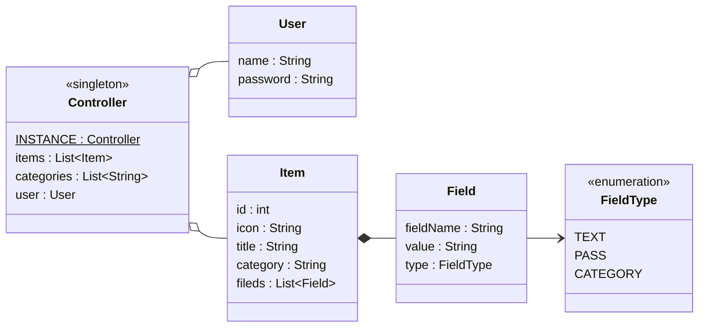

# Vault-Vader - Specifikácó

> Írta: Szenes Márton - Dátum: 2024.10.21.
>
> Projekt neve : **Vault-Vader**

## Rövid leírás
A **Vault-Vader** egy jelszókezelő alkalmazás, amelyet Java nyelven, **Swing** GUI felülettel valósítunk meg. Az alkalmazás lehetővé teszi a felhasználók számára a saját profiljuk létrehozását, bejegyzések létrehozását és kezelését, amiben jelszavaik és egyéb érzékeny adataikat kezelhetik, illetve kategóriákat hozhatnak létre a bejegyzések csoportosításához.

## Funkcionalitások

### Felhasználókezelés
- **Felhasználói fiókok létrehozása**: Új felhasználók regisztrálhatnak saját fiókot egy felhasználónév és jelszó kombinációval.
- **Bejelentkezés**: Felhasználók bejelentkezhetnek a saját fiókjukba a korábban regisztrált felhasználónév és jelszó kombinációjukkal.
- **Felhasználói adatok tárolása**: Minden felhasználóhoz tartozik egy egyedi fájl, amely (részlegesen) titkosítottan tárolja az adataikat.
- **Autentikálás**: A felhasználó neve és jelszava alapján generált eltitkosított kulcs van a fájlban tárolva, amivel autentikálja a felhasználót a program.

### Bejegyzéskezelés
- **Új bejegyzés hozzáadása**: A felhasználók új bejegyzéseket adhatnak hozzá, melyek alapértelmezés szerint a következő mezőket tartalmazzák: **bejegyzés címe**, **ikon**, **kategória**, **felhasználónév**, **jelszó**.
- **További mezők hozzáadása**: A felhasználó további egyedi mezőket is hozzáadhat az egyes bejegyzésekhez, egyedi névvel. Ezek lehetnek jelszó vagy szöveg mezők is.
- **Bejegyzés szerkesztése**: A felhasználó tudja a bejegyzések mezőit tetszés szerint szerkeszteni. A módosításokat a _Mentés_ gombbal tudja elmenti.
- **Bejegyzés törlése**: A felhasználó tudja a bejegyzést törölni is.

### Kategorizálás
- **Bejegyzések kategorizálása**: A felhasználók bejegyzéseiket különböző kategóriákba sorolhatják (pl. munkahelyi, személyes, pénzügyek, stb.).
- **Kategóriák kezelése**: A felhasználó tud új kategóriákat felvenni, a nevüket módosítani és törölni is.

### Biztonság
- **Titkosított adatok**: Minden felhasználó adatai külön-külön fájlokban (`<felhasználónév>.json`), részben titkosítva kerülnek tárolásra, ahol a jelszó mezők tartalmait eltitkosítja a program, de a szöveges mezőit nem.
- **Titkosítás**: A program egyszerűsége miatt egy XOR titkosítást valósít meg a program amiben az adat a jelszó és a kulcs a felhasználónév minden esetben.

### Grafikus felhasználói felület (GUI)
- **Java Swing alapú felület**: A rendszer GUI-ja Java Swing segítségével kerül megvalósításra, ahol a felhasználók könnyen kezelhetik a bejegyzéseiket és kategorizálhatják azokat.

## Fájlkezelés

- **Fájlformátum**: A felhasználók fájljait `<felhasználónév>.json` formátumban tárolja el a program.
- **JSON kulcsok**:
  - Felhasználónév: `username`
  - Jelszó: `password`
  - Ketegóriák lista: `category`
    - szöveges lista, String-eket tárol
  - Bejegyzések lista: `items`
    - Bejegyzés címe: `title`
    - Bejegyzés ikonja: `icon`
    - Bejegyzés kategóriája: `category`
    - Mező lista: `fields`
      - Mező neve: `fieldName`
      - Mező típusa: `type`
      - Mező értéke: `value`
  
# Modell

